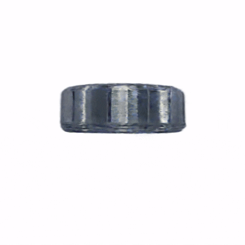
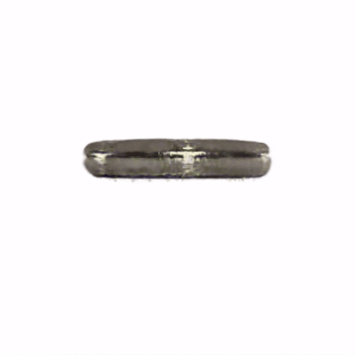
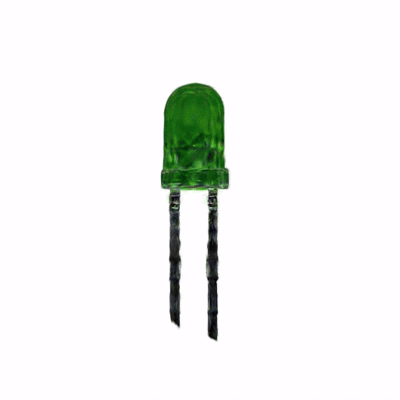
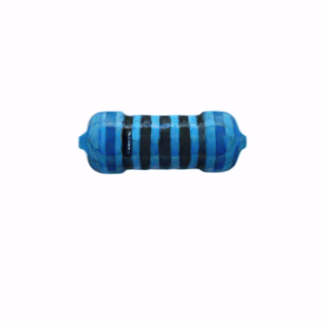
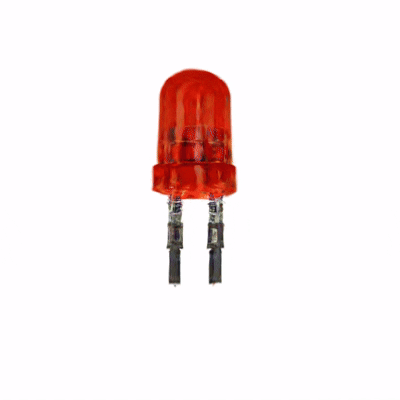
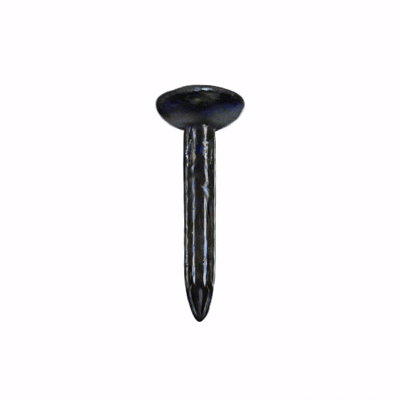
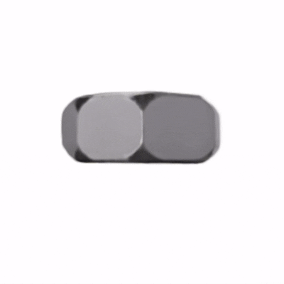

# [CVPR 2026 Findings] ForgeDreamer: Industrial Text-to-3D Generation with Multi-Expert LoRA and Cross-View Hypergraph

[](https://arxiv.org/abs/2603.09266)

<div align="center">

### Junhao Cai<sup>1, *</sup>, Deyu Zeng<sup>2, *</sup>, Junhao Pang<sup>1</sup>, Lini Li<sup>1</sup>, Zongze Wu<sup>1</sup>, Xiaopin Zhong<sup>1, †</sup>

<sup>1</sup> Shenzhen University, Shenzhen, Guangdong 518060, China <br>
<sup>2</sup> Guangzhou Maritime University, Guangzhou, Guangdong 510725, China <br>

<sup>*</sup> Equal contribution. &nbsp;&nbsp;&nbsp;&nbsp; <sup>†</sup> Corresponding author.

[Paper PDF (Arxiv)](https://arxiv.org/abs/2603.09266) | [Project Page (Coming Soon)](#) 

</div>

---

<div align="center">
<h3>Generated 3D Models Showcase</h3>

<table>
  <tr>
    <td align="center">
      <b>Bearing</b><br>
      
    </td>
    <td align="center">
      <b>Gasket</b><br>
      
    </td>
    <td align="center">
      <b>Green LED</b><br>
      
    </td>
    <td align="center">
      <b>Resistor</b><br>
      
    </td>
  </tr>
  
  <tr>
    <td align="center">
      <b>Red LED</b><br>
      
    </td>
    <td align="center">
      <b>Nail</b><br>
      
    </td>
    <td align="center">
      <b>Nut</b><br>
      
    </td>
    <td align="center">
      <b>Screw</b><br>
      
    </td>
  </tr>
</table>

Examples of industrial text-to-3D content creations generated by our **ForgeDreamer** framework.
</div>

## 🎏 Abstract

We present **ForgeDreamer**, a novel framework tailored for industrial text-to-3D generation. By integrating Multi-Expert LoRA and a Cross-View Hypergraph, ForgeDreamer effectively captures the intricate geometric structures, strict topologies, and precise physical properties required for high-fidelity industrial parts.

<details><summary>CLICK for the full abstract</summary>

> Current text-to-3D generation methods excel in natural scenes but struggle with industrial applications due to two critical limitations: domain adaptation challenges where conventional LoRA fusion causes knowledge interference across categories, and geometric reasoning deficiencies where pairwise consistency constraints fail to capture higher-order structural dependencies essential for precision manufacturing. 
We propose a novel framework named ForgeDreamer addressing both challenges through two key innovations. First, we introduce a Multi-Expert LoRA Ensemble mechanism that consolidates multiple category-specific LoRA models into a unified representation, achieving superior cross-category generalization while eliminating knowledge interference. Second, building on enhanced semantic understanding, we develop a Cross-View Hypergraph Geometric Enhancement approach that captures structural dependencies spanning multiple viewpoints simultaneously.
These components work synergistically improved semantic understanding, enables more effective geometric reasoning, while hypergraph modeling ensures manufacturing-level consistency. Extensive experiments on a custom industrial dataset demonstrate superior semantic generalization and enhanced geometric fidelity compared to state-of-the-art approaches.

</details>

## ✅ Before You Start

To avoid path/config mismatch issues later, confirm the following first:

- You have an NVIDIA GPU environment that can run CUDA 12.1 + PyTorch CUDA builds.
- You have enough disk space for:
  - dataset images,
  - intermediate LoRA checkpoints (`lora_weight_before_distill/`),
  - distilled LoRA outputs (`lora_train/multi_combine_*/`),
  - Text-to-3D outputs (`output/<workspace>/`).
- You decide your workflow route in advance:
  - **Route A (Fastest):** Use provided distilled LoRA weights → go directly to **Step 3** and **Step 4**.
  - **Route B (Full training):** Train per-concept LoRAs + distillation → run **Step 1 → Step 4** end-to-end.

## 🔧 Installation

We recommend using Anaconda to manage the environment. Please follow the steps below to set up the environment:

### Step 0 — Install CUDA Toolkit 12.1

Before setting up the Python environment, make sure **CUDA Toolkit 12.1** is installed on your server.

**Linux (Ubuntu 22.04 x86_64):**

```bash
wget https://developer.download.nvidia.com/compute/cuda/12.1.0/local_installers/cuda_12.1.0_530.30.02_linux.run
sudo sh cuda_12.1.0_530.30.02_linux.run
```

> For other operating systems and architectures, download the appropriate installer from the official CUDA 12.1 archive:
> 👉 **[https://developer.nvidia.com/cuda-12-1-0-download-archive](https://developer.nvidia.com/cuda-12-1-0-download-archive)**

---

### Step 1 — Clone the repository

```bash
git clone https://github.com/Junhaocai27/ForgeDreamer.git --recursive
cd ./ForgeDreamer
```

### Step 2 — Create and activate the Conda environment

```bash
conda create -n "ForgeDreamer" python=3.10 -y
conda activate ForgeDreamer
```

### Step 3 — Set CUDA architecture list

Adjust the architecture flags according to your GPU if necessary:

```bash
export TORCH_CUDA_ARCH_LIST="7.0;7.5;8.0;8.6;8.9;9.0+PTX"
```

### Step 4 — Install Python dependencies

```bash
pip install -r requirements.txt
pip install dhg==0.9.5 --no-deps
```

### Step 5 — Install custom submodules and local packages

```bash
pip install submodules/diff-gaussian-rasterization --no-build-isolation
pip install submodules/simple-knn/ --no-build-isolation
pip install ./LoRA_Distillation --no-build-isolation
```

---

## 📦 Dataset and Pretrained Model

### Dataset

The custom industrial dataset used to train and evaluate ForgeDreamer is available on Google Drive:

👉 **[Download Dataset](https://drive.google.com/drive/folders/1xvphtOr9_fKJWhtEggp2OJx2HPNd1Jnf?usp=sharing)**

The dataset contains multi-view images of industrial components (bearings, gaskets, LEDs, resistors, nails, nuts, screws, etc.) that are used as training images for the per-concept LoRA fine-tuning step.

**Instructions:**

1. Open the link above and download the dataset folder (or individual category sub-folders).
2. Place the downloaded images under a local directory, for example:
   ```
   data/
   ├── screw/
   │   ├── front/
   │   │   ├── 1.png
   │   │   ├── 2.png
   │   │   └── ...
   │   └── up/
   │       ├── 1.png
   │       ├── 2.png
   │       └── ...
   ├── nut/
   │   └── ...
   └── ...
   ```
3. Set the `INSTANCE_DIR` variable in `LoRA_Distillation/training_scripts/train_lora.sh` to the path of the relevant view sub-folder (e.g. `data/screw/front` or `data/screw/up`) when training individual LoRA weights (see **Step 1** below).

> Recommended naming convention for robust downstream processing: use lowercase letters, numbers, and underscores in concept/view names (e.g. `screw_front`, `green_led_up`) so that generated placeholder tokens remain clean and unambiguous.

### Pretrained Model

ForgeDreamer uses **Stable Diffusion v2.1-base** as the base generative model. You can download it from HuggingFace:

👉 **[Download Stable Diffusion v2.1-base](https://huggingface.co/sd-research/stable-diffusion-2-1-base)**

After downloading, set the `MODEL_NAME` variable in `LoRA_Distillation/training_scripts/train_lora.sh` and the `model_key` field in your YAML config to the local path or HuggingFace ID of the downloaded model.

### Distilled LoRA Weights (Ready to Use)

We also provide already distilled LoRA weights on Google Drive:

👉 **[Download Distilled Weights](https://drive.google.com/drive/folders/1TGsymqKlatDS65TuYX3URsGXle43sQKm?usp=sharing)**

If you use these ready-made distilled weights, you can skip **Step 1** and **Step 2** in the workflow below.  
After downloading, place the `.safetensors` file under your local `lora_train/` directory and set `GuidanceParams.LoRA_path` in your YAML config to the exact file path (see **Step 3**).

---

## 🧭 Workflow at a Glance

```text
Install environment
    ↓
Prepare dataset + base SD model
    ↓
Choose route:
  A) Use provided distilled LoRA  ──→ Step 3 (YAML) ──→ Step 4 (train.py)
  B) Train your own:
       Step 1 (per-concept LoRA)
         ↓
       Step 2 (multi-LoRA distillation)
         ↓
       Step 3 (YAML)
         ↓
       Step 4 (train.py)
```

---

## 🗂️ Repository Structure

```
ForgeDreamer/
├── train.py                                  # Main Text-to-3D training script
├── train.sh                                  # Shell script to launch train.py
├── configs/
│   └── screw.yaml                            # Example YAML configuration
├── data/
│   └── screw/                                # Example category folder (one folder per category)
│       ├── front/                            # Front-view training images (1.png, 2.png, …)
│       └── up/                               # Top-down training images (1.png, 2.png, …)
├── lora_weight_before_distill/               # Individual LoRA weights saved after Step 1
│   └── screw_front/                          # Output directory for each per-view LoRA
├── distill_lora_weight/                      # Renamed per-concept LoRA files used as Step 2 input
│   ├── screw_front.safetensors
│   └── screw_up.safetensors
├── guidance/
│   ├── sd_utils.py                           # SD guidance utilities (ISM/SDS, DHG hypergraph)
│   ├── hypergraph_enhancer.py                # DHG latent hypergraph gradient enhancer
│   ├── perpneg_utils.py                      # Perpendicular-negative weighting utilities
│   ├── mask_utils.py                         # Subject mask generation (HSV-based)
│   └── sd_step.py                            # DDIM step helper
├── gaussian_renderer/
│   ├── __init__.py                           # Gaussian splatting renderer with augmentation
│   └── network_gui.py                        # Network GUI connection handler
├── scene/                                    # Scene and camera utilities
├── utils/                                    # Shared utility functions
└── LoRA_Distillation/
    ├── lora_diffusion/
    │   ├── distill_lora.py                   # Multi-teacher LoRA distillation training script
    │   ├── feature_hook_unet.py              # UNet feature alignment hooks & losses
    │   ├── feature_hook_text_encoder.py      # Text encoder feature alignment hooks & losses
    │   ├── dynamic_weight.py                 # Dynamic weight adjustment for distillation
    │   └── ...                               # Other lora_diffusion package modules
    └── training_scripts/
        ├── train_lora.sh                     # Step 1: Train a single LoRA weight
        └── distill_lora.sh                   # Step 2: Distil multiple LoRAs into one
```

---

## 🚀 Four-Step Usage Workflow

### Step 1 — Train individual LoRA weights

Train a separate LoRA for each concept (object / viewpoint / appearance) you want the final model to capture. This uses the `lora_pti` command-line tool installed from the `LoRA_Distillation` package.

**Script:** `LoRA_Distillation/training_scripts/train_lora.sh`

Edit the variables at the top of the script before running:

| Variable | Description |
|---|---|
| `MODEL_NAME` | Path or HuggingFace ID of the base SD model (e.g. `stabilityai/stable-diffusion-2-1-base`) |
| `INSTANCE_DIR` | Directory containing training images for this concept |
| `OUTPUT_DIR` | Where to save the resulting LoRA weights (e.g. `lora_weight_before_distill/screw_front`) |
| `--placeholder_tokens` | The trigger token for this concept (e.g. `<screw_front>` for the front-view LoRA, `<screw_up>` for the top-down LoRA) |

```bash
bash LoRA_Distillation/training_scripts/train_lora.sh
```

Repeat this step for **every** concept and viewpoint. For example, you might train one LoRA for the front-view appearance (`<screw_front>`) and another for the top-down appearance (`<screw_up>`), saving each to a separate output directory.

---

### Step 2 — Distil multiple LoRA weights into one

Once all per-concept LoRAs are trained (for example under `lora_weight_before_distill/screw_front/` and `lora_weight_before_distill/screw_up/`), **rename** each `final_lora.safetensors` file to match its concept name and copy it into a single `distill_lora_weight/` folder before running the distillation script. The distillation script infers placeholder tokens directly from filenames (e.g. `screw_front.safetensors` → token `<screw_front>`), so renaming is required.

Filename-to-token rule of thumb:
- `xxx.safetensors` → token `<xxx>`
- Avoid spaces and special symbols in `xxx`
- Keep token naming consistent with how you plan to write prompts in Step 3

For example, after training the `screw_front` and `screw_up` LoRAs:

```bash
mkdir -p distill_lora_weight

cp lora_weight_before_distill/screw_front/final_lora.safetensors distill_lora_weight/screw_front.safetensors
cp lora_weight_before_distill/screw_up/final_lora.safetensors   distill_lora_weight/screw_up.safetensors
```

After this step the folder should look like:

```
distill_lora_weight/
├── screw_front.safetensors
└── screw_up.safetensors
```

**Script:** `LoRA_Distillation/training_scripts/distill_lora.sh`

Edit the variables at the top of the script before running:

| Variable | Description |
|---|---|
| `LORA_MODELS_DIR` | Directory containing all the renamed LoRA weight files to distil (e.g. `distill_lora_weight`) |
| `BASE_MODEL` | Path or HuggingFace ID of the base SD model |
| `OUTPUT_DIR` | Where to save the distilled LoRA (auto-timestamped, e.g. `lora_train/multi_combine_20240101_120000`) |

Set `LORA_MODELS_DIR` in `LoRA_Distillation/training_scripts/distill_lora.sh` to the same folder you prepared above (for example `distill_lora_weight`).

The script automatically infers placeholder tokens from filenames (e.g. `screw_front.safetensors` → token `<screw_front>`).

```bash
bash LoRA_Distillation/training_scripts/distill_lora.sh
```

The distilled LoRA is saved to:
```
$OUTPUT_DIR/multi_teacher_distilled/final_multi_teacher_hybrid_lora_step_<N>.safetensors
```
where `<N>` is the total number of LoRA tuning steps, controlled by the `--max_train_steps_tuning` argument (default: `5000`). With the default settings the filename will be `final_multi_teacher_hybrid_lora_step_5000.safetensors`.

---

### Step 3 — Configure the YAML file

Edit `configs/screw.yaml` (or create your own config based on it) and update the following key fields:

```yaml
GuidanceParams:
  model_key: 'stabilityai/stable-diffusion-2-1-base'      # Base SD model key or local path
  text: 'A highly detailed ... <screw> ...'               # Prompt including your trigger token(s)
  LoRA_path: "lora_train/multi_combine_<YYYYMMDD_HHMMSS>/multi_teacher_distilled/final_multi_teacher_hybrid_lora_step_5000.safetensors"  # replace <YYYYMMDD_HHMMSS> with the timestamp from your distill_lora.sh run; 5000 = --max_train_steps_tuning
  negative: 'unrealistic, blurry, low quality, ...'       # Negative prompt
  inverse_text: ''                                         # Text for DDIM inversion (ISM mode)

ModelParams:
  workspace: my_output_name    # Output folder name under ./output/
```

Important prompt/token consistency note:
- If Step 2 generated tokens like `<screw_front>` and `<screw_up>`, your `GuidanceParams.text` should include the token(s) you actually want to activate.
- For single-concept distilled LoRA, one trigger token is usually sufficient.
- For multi-concept distilled LoRA, include the relevant token combination explicitly in the prompt text.

Key optional parameters in `GuidanceParams`:

| Parameter | Default | Description |
|---|---|---|
| `perpneg` | `true` | Perpendicular-negative multi-view guidance |
| `C_batch_size` | `4` | Number of camera views per SDS step |
| `t_range` | `[0.02, 0.5]` | Diffusion timestep range for SDS sampling |
| `guidance_scale` | `7.5` | Classifier-free guidance scale |
| `ddim_inv` | `true` | Use DDIM inversion (ISM) instead of plain SDS |
| `use_dhg_latent_hypergraph` | `true` | Enable DHG latent hypergraph gradient enhancement |
| `fixed_view` | `true` | Use fixed front/up camera viewpoints |

---

### Step 4 — Run Text-to-3D generation

**Script:** `train.sh`

```bash
bash train.sh
```

This runs:
```bash
CUDA_VISIBLE_DEVICES=0 python train.py --opt configs/screw.yaml
```

To use a different config file:
```bash
python train.py --opt configs/your_config.yaml
```

Training outputs (Gaussian point clouds, rendered images, videos, TensorBoard logs) are saved under `./output/<workspace>/`.

Monitor training progress with TensorBoard:
```bash
tensorboard --logdir ./output/<workspace>
```

---

## ✅ End-to-End Consistency Checklist

Before launching long training runs, quickly check:

- `MODEL_NAME` / `BASE_MODEL` / `GuidanceParams.model_key` refer to the same SD base model family.
- `GuidanceParams.LoRA_path` points to an existing `.safetensors` file.
- Prompt trigger token(s) in `GuidanceParams.text` match Step 2 filename-derived token names.
- `ModelParams.workspace` is unique enough to avoid overwriting old experiments.
- Selected config file in `train.py --opt ...` is the one you actually edited.

---

## 📋 Configuration Reference

### `GuidanceParams`

| Key | Description |
|---|---|
| `model_key` | HuggingFace model ID or local path to the base SD model |
| `text` | Text prompt (include LoRA trigger tokens, e.g. `<screw>`) |
| `LoRA_path` | Path to the distilled LoRA `.safetensors` file |
| `negative` | Negative prompt |
| `inverse_text` | Text for DDIM inversion; leave empty `''` for default |
| `perpneg` | Enable perpendicular-negative guidance (`true` recommended) |
| `C_batch_size` | Number of cameras per SDS step |
| `guidance_scale` | Classifier-free guidance scale |
| `t_range` | `[min, max]` timestep fraction range for SDS sampling |
| `ddim_inv` | Use ISM (DDIM inversion) rather than standard SDS |
| `use_dhg_latent_hypergraph` | DHG latent hypergraph gradient enhancement |
| `fixed_view` | Fix front/top-down camera viewpoints during training |
| `tensorboard_log_dir` | Directory for TensorBoard logs |

### `GenerateCamParams`

| Key | Description |
|---|---|
| `init_shape` | Point cloud initialisation: `'pointe'` or `'sphere'` |
| `init_prompt` | Prompt for Point-E initialisation (e.g. `'a thin rod'`) |
| `phi_range` | Azimuth angle range in degrees |
| `theta_range` | Elevation angle range in degrees |
| `radius_range` | Camera-to-origin distance range |

### `OptimizationParams`

| Key | Description |
|---|---|
| `iterations` | Total training steps |
| `warmup_iter` | Steps before enabling 45° view cameras |
| `densify_from_iter` | Gaussians densification start step |
| `densify_until_iter` | Gaussians densification end step |
| `save_process` | Save a training-progress video (`true`/`false`) |

---

## 📄 Citation

If you find ForgeDreamer useful for your research, please cite our paper:

```bibtex
@article{cai2026forgedreamer,
  title={ForgeDreamer: Industrial Text-to-3D Generation with Multi-Expert LoRA and Cross-View Hypergraph},
  author={Cai, Junhao and Zeng, Deyu and Pang, Junhao and Li, Lini and Wu, Zongze and Zhong, Xiaopin},
  journal={arXiv preprint arXiv:2603.09266},
  year={2026}
}
```
## 🙏 Acknowledgement

This work is built on many amazing research works and open-source projects:

* [gaussian-splatting](https://github.com/graphdeco-inria/gaussian-splatting) and [diff-gaussian-rasterization](https://github.com/graphdeco-inria/diff-gaussian-rasterization)
* [Stable-Dreamfusion](https://github.com/ashawkey/stable-dreamfusion)
* [Point-E](https://github.com/openai/point-e)
* [lora](https://github.com/cloneofsimo/lora)
* [LucidDreamer](https://github.com/EnVision-Research/LucidDreamer)

Thanks for their excellent work and great contribution to 3D generation area.
